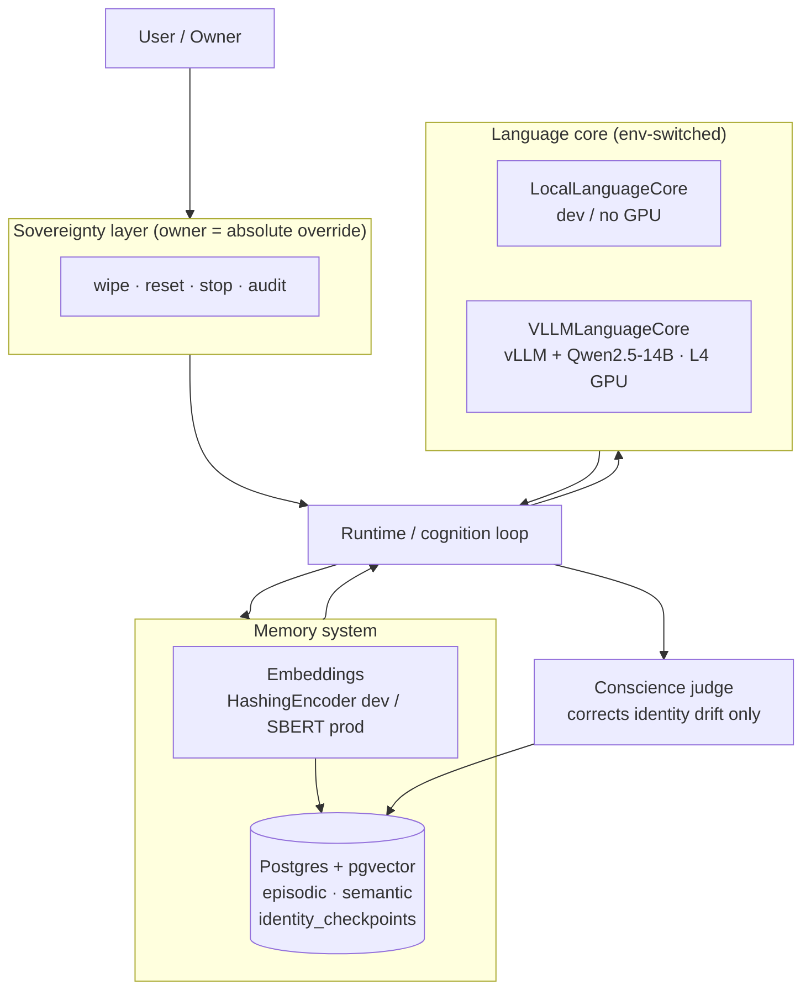

# Architecture — ODIN Temporal Identity Network



## Notes
- **One code path, two environments**: `ODIN_LLM_BACKEND` / `ODIN_ENCODER` switch dev ↔ L4 without code changes.
- **Owner override is structural**: wipe/reset/stop/audit live above the model and the judge — not a prompt.
- **Memory is the backbone**: every turn stores experience and recalls relevant context via vector search.
```
